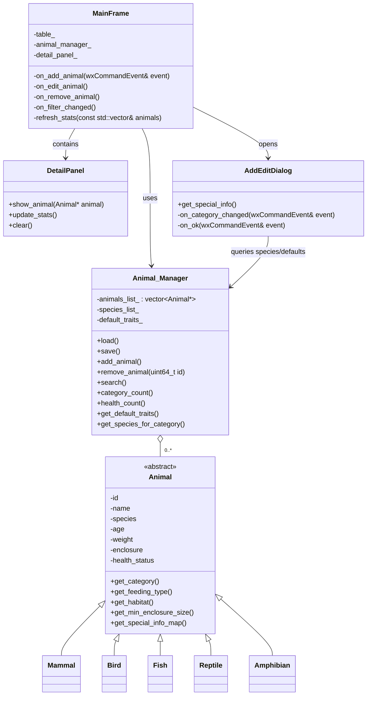

# Zoo Manager

A desktop application for managing a zoo's animal inventory, built with **C++**, **wxWidgets**, and **nlohmann/json**. The application provides a graphical interface to add, edit, remove, search, and filter animals, view species-specific details, track health status, and persist data between sessions.

## Features

- **Animal list** – displays all animals in a table with name, species, category, age, weight, enclosure, and health status.
- **Color-coded health status** – Healthy (green), Sick (red), In Treatment (yellow) shown directly in the table.
- **Add animal** – form dialog with input validation (required fields, numeric checks for age/weight/special info).
- **Edit animal** – pre-filled form dialog; changing category recreates the animal as the correct subclass.
- **Remove animal** – with confirmation dialog before deletion.
- **Detail panel** – shows subclass-specific information (feeding type, habitat, minimum enclosure size, special info) for the selected animal.
- **Enclosure assignment** – each animal is assigned to an enclosure (e.g. Savanna, Aquarium, Aviary, Terrarium...).
- **Health status management** – set an animal's status to Healthy, Sick, or In Treatment via dropdown.
- **Live search** – filter animals in real time by name or species.
- **Category & status filters** – dropdowns to filter the list by animal category (Mammal, Bird, Reptile, Fish, Amphibian) and by health status.
- **Statistics overview** – total animal count plus per-category and per-health-status counts, shown in the status bar and overview panel.
- **Persistence** – all data is saved to `data.json` on every change and reloaded automatically on startup. If no save file exists, a set of demo animals is loaded instead.

## Architecture

### Class overview



### Project structure

```
zoo-manager/
├── animals/
│   ├── animal.hpp / animal.cpp        # abstract base class
│   ├── mammal.hpp / mammal.cpp
│   ├── bird.hpp / bird.cpp
│   ├── fish.hpp / fish.cpp
│   ├── reptile.hpp / reptile.cpp
│   └── amphibian.hpp / amphibian.cpp
├── app/
│   ├── animal_manager.hpp / .cpp      # data storage, JSON load/save, search & filtering
│   ├── zoo_app.hpp / .cpp             # wxApp entry point
├── gui/
│   ├── main_frame.hpp / .cpp          # main window, table, buttons, filters
│   ├── detail_panel.hpp / .cpp        # subclass-specific detail view + stats overview
│   └── add_edit.hpp / .cpp            # add/edit dialog with dynamic special-info fields
├── data.json                          # persisted animal data (created on first save)
├── species.json                       # species lists and default special-info templates
├── CMakeLists.txt
└── README.md
```

### Design notes

- Each animal subclass stores its category-specific attributes in a `special_info_` map (`std::map<std::string, std::string>`) instead of individual member variables. This allows new fields to be added via `species.json` without changing any class headers.
- `Animal_Manager` owns all `Animal*` instances and is responsible for their lifetime (allocation in `add_animal()`, deallocation in `remove_animal()` and its destructor).
- `species.json` is the single source of truth for both the species dropdown lists and the default special-info templates used when adding a new animal.

## Build instructions

### Requirements

- CMake ≥ 3.16
- A C++17-compatible compiler (GCC, Clang, or MSVC)
- [wxWidgets](https://www.wxwidgets.org/) (3.x)
- [nlohmann/json](https://github.com/nlohmann/json) (header-only; fetched automatically or installed via package manager)

### Build steps

```bash
mkdir build && cd build
cmake ..
cmake --build .
```

### Running

From the `build` directory:

```bash
./ZooManager
```

The application looks for `data.json` and `species.json` in the parent directory of the build folder (`../data.json`, `../species.json`). If `data.json` does not exist, a set of demo animals is loaded automatically and a new file is created on the first save.

## User manual

1. **Browsing animals** – On startup, all saved animals are listed in the table on the left. Health status is color-coded (green = Healthy, red = Sick, yellow = In Treatment).
2. **Viewing details** – Click any row to open its details in the panel on the right, including feeding type, habitat, minimum enclosure size, and species-specific info. The bottom of the panel shows live statistics (total, healthy, sick, in treatment).
3. **Adding an animal** – Click **+Add animal**, fill in the form (name, category, species, age, weight, enclosure, health status, and any special info fields), and click **Save**. Fields are validated before the animal is added.
4. **Editing an animal** – Select a row, click **Edit**, change the desired fields, and click **Save**. If the category is changed, the animal is recreated as the new subclass.
5. **Removing an animal** – Select a row, click **Remove**, and confirm the deletion in the dialog that appears.
6. **Searching** – Type into the search box to filter the table in real time by name or species.
7. **Filtering** – Use the category and health status dropdowns to narrow down the list. Filters can be combined with the search box.

## Authors

- Viktor Borosnyai – *(role / contributions)*
- Ema Toplek – *(role / contributions)*

## Division of Work

**Viktor**
- `Animal` base class, `Mammal`, `Amphibian` and `Fish` subclasses
- Health state machine (Sick → In Treatment → Healthy ticks)
- JSON save/load with demo-animal fallback
- Animal list view with color-coded health status, real-time search & filter wiring
- Autotests for own classes/logic

**Ema**
- `Bird` and `Reptile` subclasses
- Search & filter logic (name, species, category, health status)
- Enclosure assignment and health status updates
- Detail panel, Add/Edit dialog with validation, Remove confirmation, statistics panel
- Autotests for own classes/logic


## License

This project is licensed under the [MIT License](LICENSE).