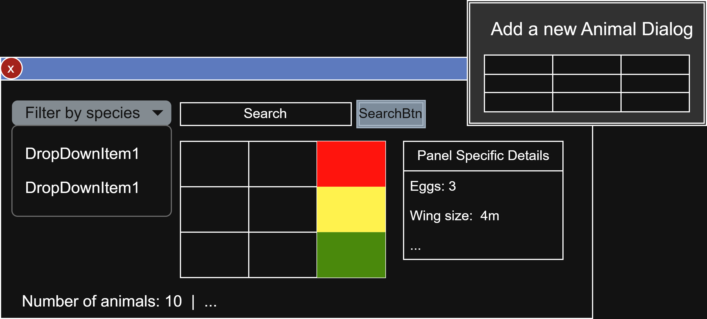

Zoo Manager
==========

Specification
------------------

1) display a list of all animals with their name, species, category, age, and weight
2) health status is color-code in list
3) add a new animal via a form dialog with input validation
4) remove a selected animal from the list + confirm dialog
5) edit an existing animal's information
6) animal base class with subclasses: mammal, bird, fish
7) each subclass implements feeding type, habitat requirement, min enclosure size
8) selected animals subclass-specific info swhon into detail panel
9) assign an animal to an enclosure (e.g. "Savanna", "Aquarium")
10) set the health status of an animal (Healthy / Sick / In Treatment)
11) sick animals automatically progress to In Treatment after xy ticks
12) In Treatment animals automatically progress to Healthy after xy ticks
13) search animals in real time by name or species
14) filter the list by animal category via dropdown (Mammal, Bird, Reptile, Fish)
filter the list by health status via dropdown
15) show basic statistics: total number of animals, count per category
16) save all data to a JSON file on exit and reload it on startup
17) if no save file exists, load a set of default demo animals

Classes
--------

- **ZooApp** class inherited from **wxApp** class
    - `OnInit()` method that starts the App
- **ZooFrame** class inherited from **wxFrame** class
    - this stores the `wxPanel`
        - this stores the controls (buttons, timer, table...)
    - this stores a pointer to `AnimalRepository` object

- **Animal** class `spec 3)`
    - common properties `spec 7)`
        - feeding type (string?)
        - habitat requirement (string?)
        - min enclosure size (string?)
        - health_status_ (HealthStatus enum) `spec 10)`
    - methods:
        - getters
        - setters
            - setHealthStatus() `spec 10)`
    - Inheritance: `spec 6)`
        - **Fish**
        - **Amphibians**
        - **Reptiles**
        - **Birds**
        - **Mammal**
- **HealthStatus** enum class
    - (Sick / In Treatment / Healthy)
    - color codes: Red / Yellow / Green
        
- **AnimalRepository** class `spec 4)`
    - this class stores the Animals in a vector
    - methods:
        - `add()` - adds an animal to the vector
        - `remove()` - removes an animal from the vector
        - `edit()` - `spec 5)` - edits animal
        - `healthCheck()` - checks an animal's heath status if he automatically goes in treatment or gets healthy based on the timer's ticks - `spec 11) 12)`
            - Sick --> In Treatment --> Healthy --> Sick...
        - `search(by="...", keyword="...")`  -`spec 13)`
            - by="name" or by="species"
            - keyword="turtle"
        - `save()` --> data.json
        - `load()` <-- data.json   /   demo.json

GUI
--------

- table, with columns `spec 1)`
    - only common properties shown
    - health status: colored column `spec 2)`
- new dialog window to add an animal `spec 3) 9)`
- detail panel near the table (animal specific properties) `spec 8)`
- search input, options (name/species) `spec 13`
- dropdown list to filter by species `spec 14)`
- text statistics on the bottom of the window

